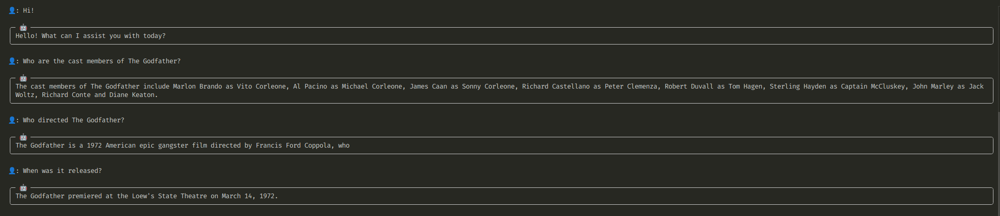

# Usage

## Example RAG Application

This guide demonstrates how to create a Retrieval-Augmented Generation (RAG) pipeline using `bookacle`. You only need 16 lines of code to get started!

### Full Code

The complete example shows how to load a document, create a RAPTOR tree for retrieval, and run a query on the document.

??? Code

    ```python
    from bookacle.loaders import pymupdf_loader
    from bookacle.models.embedding import SentenceTransformerEmbeddingModel
    from bookacle.models.message import Message
    from bookacle.models.qa import OllamaQAModel
    from bookacle.models.summarization import HuggingFaceLLMSummarizationModel
    from bookacle.splitters import HuggingFaceTextSplitter
    from bookacle.tree.builder import ClusterTreeBuilder
    from bookacle.tree.config import ClusterTreeConfig, TreeRetrieverConfig
    from bookacle.tree.retriever import TreeRetriever

    documents = pymupdf_loader(file_path="data/the-godfather.pdf")

    embedding_model = SentenceTransformerEmbeddingModel(
        model_name="sentence-transformers/all-MiniLM-L6-v2"
    )

    summarization_model = HuggingFaceLLMSummarizationModel(
        model_name="Qwen/Qwen2-0.5B-Instruct",
        summarization_length=100,
    )

    qa_model = OllamaQAModel(model_name="qwen2.5:0.5b-instruct")

    document_splitter = HuggingFaceTextSplitter(tokenizer=embedding_model.tokenizer)

    config = ClusterTreeConfig(
        embedding_model=embedding_model,
        summarization_model=summarization_model,
        document_splitter=document_splitter,
    )

    tree_builder = ClusterTreeBuilder(config=config)

    tree = tree_builder.build_from_documents(documents=documents)

    retriever_config = TreeRetrieverConfig(embedding_model=embedding_model)
    retriever = TreeRetriever(config=retriever_config)

    query = "Who are the cast members of The Godfather?"

    _, context = retriever.retrieve(query=query, tree=tree)

    system_prompt = """You are a helpful assistant, designed to help users understand documents and answer questions on the documents.
    Use your knowledge and the context passed to you to answer user queries.
    The context will be text extracted from the document. It will be denoted by CONTEXT: in the prompt.
    The user's query will be denoted by QUERY: in the prompt.
    Do NOT explicitly state that you are referring to the context.
    """

    history = [Message(role="system", content=system_prompt)]

    answer = qa_model.answer(
        question=query, context=context, stream=False, history=history
    )

    print(f"Answer:\n{answer['content']}")
    ```

### Step-by-Step Walkthrough

We now walk through the code step-by-step with explanations of each part.

??? Imports

    ```python exec="true" source="material-block" session="rag"
    from bookacle.loaders import pymupdf_loader
    from bookacle.models.embedding import SentenceTransformerEmbeddingModel
    from bookacle.models.qa import OllamaQAModel
    from bookacle.models.summarization import HuggingFaceLLMSummarizationModel
    from bookacle.splitters import HuggingFaceTextSplitter
    from bookacle.tree.builder import ClusterTreeBuilder
    from bookacle.tree.config import ClusterTreeConfig, TreeRetrieverConfig
    from bookacle.tree.retriever import TreeRetriever
    from bookacle.models.message import Message
    ```

We start by loading the data file using [`pymupdf_loader()`][bookacle.loaders.pymupdf_loader], which uses [PyMuPDF](https://pymupdf.readthedocs.io/en/latest/) to load the PDF file as text. The example uses the first 2 pages (when exported in A3) of the Wikipedia entry on [The Godfather](https://en.wikipedia.org/wiki/The_Godfather):

```python exec="true" source="material-block" result="python" session="rag"
documents = pymupdf_loader(file_path="data/the-godfather.pdf")

print(f"Number of documents: {len(documents)}")
print(f"First document:\n{documents[0]}")
```

???+ note "More on Document Loaders"

    See [Document Loaders](loaders.md) for more details on loaders and how you can create your own loaders.

Then we create the embedding model and the summarization model that will be used to create the RAPTOR tree. We also create the question-answering model that will be used to answer user queries on the PDF document.

- For the embedding model, we are using [`SentenceTransformerEmbeddingModel`][bookacle.models.embedding.SentenceTransformerEmbeddingModel] to load the [`all-MiniLM-L6-v2`](https://huggingface.co/sentence-transformers/all-MiniLM-L6-v2) model from the [`sentence-transformers`](https://sbert.net/) library.
- For the summarization model, we are using [`HuggingFaceLLMSummarizationModel`][bookacle.models.summarization.HuggingFaceLLMSummarizationModel] to load the [`Qwen/Qwen2-0.5B-Instruct`](https://huggingface.co/Qwen/Qwen2-0.5B-Instruct) LLM from [HuggingFace](https://huggingface.co/).
- For the question-answering model, we are using [`OllamaQAModel`][bookacle.models.qa.OllamaQAModel] to load the [`qwen2.5:0.5b-instruct`](https://ollama.com/library/qwen2.5:0.5b-instruct) model from [Ollama](https://ollama.com/).

```python exec="true" source="material-block" result="python" session="rag"
embedding_model = SentenceTransformerEmbeddingModel(
        model_name="sentence-transformers/all-MiniLM-L6-v2"
    )

summarization_model = HuggingFaceLLMSummarizationModel(
    model_name="Qwen/Qwen2-0.5B-Instruct",
    summarization_length=100,
)

qa_model = OllamaQAModel(model_name="qwen2.5:0.5b-instruct")

print(f"Embedding Model: {embedding_model}")
print(f"Summarization Model: {summarization_model}")
print(f"QA Model: {qa_model}")
```

???+ note "More on Models"

    See [Models](models.md) for more details on models and how you can create your own models.

We then create the document splitter that will be used to split documents into chunks. We are using [`HuggingFaceTextSplitter`][bookacle.splitters.HuggingFaceTextSplitter], which uses a HuggingFace tokenizer as the length function to decide when a piece of text should be split.

```python exec="true" source="material-block" result="python" session="rag"
document_splitter = HuggingFaceTextSplitter(tokenizer=embedding_model.tokenizer)

print(document_splitter)
```

???+ note "More on Document Splitters"

    See [Document Splitters](splitters.md) for more details on splitters and how you can create your own splitters.

    You can also use custom tokenizers by implementing the [`TokenizerLike`][bookacle.tokenizer.TokenizerLike] protocol. See [Tokenizers](tokenizers.md) for more details.

Next, we create the RAPTOR tree using [`ClusterTreeBuilder`][bookacle.tree.builder.ClusterTreeBuilder], which implements the methodology in the RAPTOR paper:

- Split the documents into chunks and create the leaf nodes from these chunks.
- For each subsequent layer:
    - Cluster the nodes in the previous layer.
    - For each cluster, concatenate the texts of the nodes, summarize the text, embed the summary and create a node.
    - Create the layer using the nodes of each cluster.
- Repeat the process till clustering is no longer possible.

```python exec="true" source="material-block" result="python" session="rag"
config = ClusterTreeConfig(
    embedding_model=embedding_model,
    summarization_model=summarization_model,
    document_splitter=document_splitter,
)

tree_builder = ClusterTreeBuilder(config=config)

tree = tree_builder.build_from_documents(documents=documents)

print(f"Tree: {tree}")
```

???+ note "More on Building the RAPTOR tree"

    See [Building the RAPTOR tree](building-raptor-tree.md) for more details on building the raptor tree and how you can define your own methodology to build the tree.

    You can also customize the clustering method used by [`ClusterTreeBuilder`][bookacle.tree.builder.ClusterTreeBuilder] by changing the clustering function and the clustering backend. See [Clustering Support](clustering.md) for more details.

We then create the retriever using [`TreeRetriever`][bookacle.tree.retriever.TreeRetriever], which implements both the collapsed-tree and tree-traversal methods from the RAPTOR paper:

```python exec="true" source="material-block" result="python" session="rag"
retriever_config = TreeRetrieverConfig(embedding_model=embedding_model)
retriever = TreeRetriever(config=retriever_config)

print(f"Retriever: {retriever}")
```

???+ note "More on Retrievers"

    See [Retriever](retriever.md) for more details on retrievers and how you can implement your own retrievers.

Then, we send a query to the retriever and fetch relevant context:

```python exec="true" source="material-block" result="text" session="rag"
query = "Who are the cast members of The Godfather?"

_, context = retriever.retrieve(query=query, tree=tree)

print(f"Retrieved context:\n{context}")
```

Finally, we set the system prompt (optional) for the question-answering model and get an answer from the it:

```python exec="true" source="material-block" result="text" session="rag"
system_prompt = """You are a helpful assistant, designed to help users understand documents and answer questions on the documents.
Use your knowledge and the context passed to you to answer user queries.
The context will be text extracted from the document. It will be denoted by CONTEXT: in the prompt.
The user's query will be denoted by QUERY: in the prompt.
Do NOT explicitly state that you are referring to the context.
"""

history = [Message(role="system", content=system_prompt)]

answer = qa_model.answer(question=query, context=context, stream=False, history=history)

print(f"Answer:\n{answer['content']}")
```

## Chat Interface

`bookacle` comes with a built-in terminal-based chat interface powered by [`rich`](https://github.com/Textualize/rich) and [`prompt-toolkit`](https://github.com/prompt-toolkit/python-prompt-toolkit), which supports the following:

- Autocompletion in the chat.
- Custom user avatars.
- Markdown rendering.
- Streaming output with a nice progress bar.
- Pass a system prompt to the question-answering model.
- Store chat history in a file as you chat, etc.

### Launch from a script

The chat interface can be launched in a script by using [`Chat`][bookacle.chat.Chat].

```python
from rich.console import Console
from bookacle.chat import Chat

console = Console()

chat = Chat(
    retriever=retriever,
    qa_model=qa_model,
    console=console,
)

system_prompt = """You are a helpful assistant, designed to help users understand documents and answer questions on the documents.
Use your knowledge and the context passed to you to answer user queries.
The context will be text extracted from the document. It will be denoted by CONTEXT: in the prompt.
The user's query will be denoted by QUERY: in the prompt.
Always respond in Markdown.
"""

chat.run(tree=tree, stream=True, system_prompt=system_prompt)
```

Here is an example interaction:



### Terminal-based Chat

You can also use the chat via the CLI to interact with your documents.

```bash exec="true" source="material-block" result="ansi"
bookacle --help
```

See [Command-Line Interface](cli.md) for more information on the usage.
